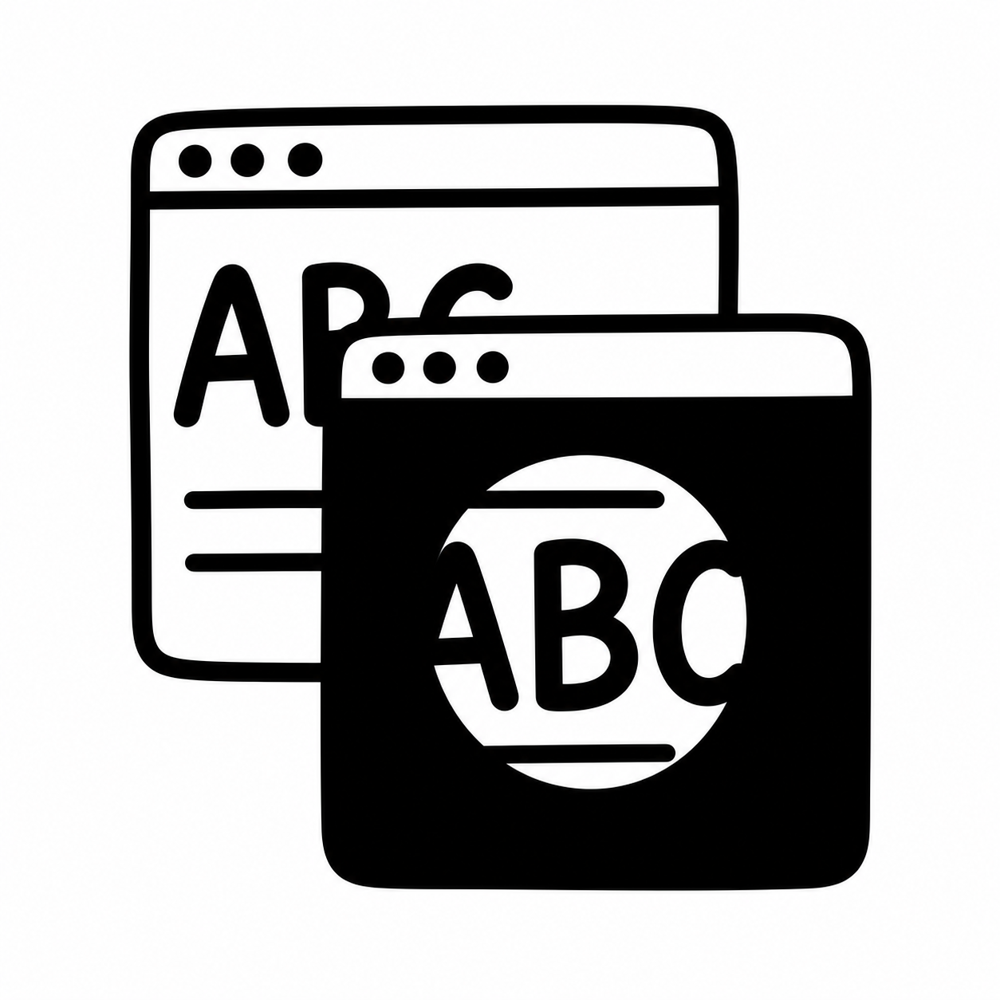
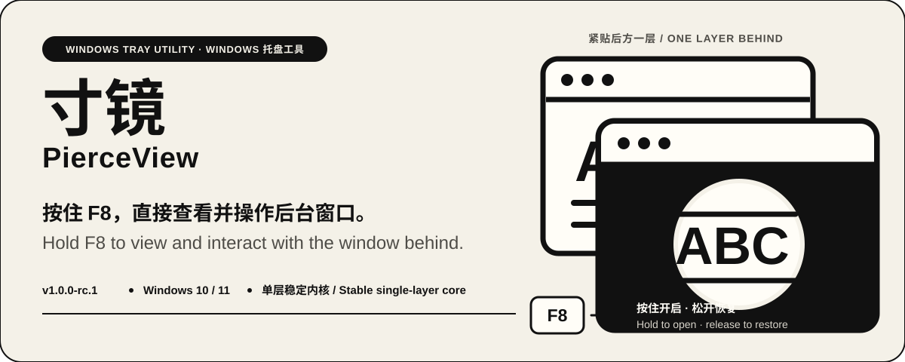
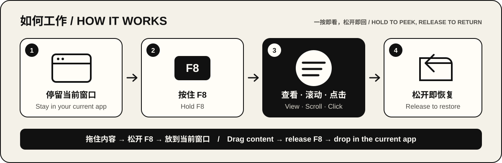

# 寸镜 / PierceView

<p align="center">
  
</p>



寸镜（PierceView）是一款轻量的 Windows 系统托盘效率工具。按住 `F8`，鼠标附近会出现一个圆形透视区域，让你不离开当前工作就能查看、滚动或点击紧贴在后方的一层窗口；松开按键，当前窗口立即恢复。

PierceView is a lightweight Windows tray utility. Hold `F8` to open a circular portal around the pointer, then view, scroll, or click the single window directly behind your current work. Release the key to restore the foreground window immediately.

**当前版本 / Current version:** `1.0.0` — 首个公开可用版本。First public release.

## 为什么是寸镜 / Why PierceView

很多次 `Alt+Tab` 并不是为了真正切换工作，只是想看一眼后台页面上的数字、进度或几行文字。寸镜把这次来回切换缩短成一次按住：思路留在当前窗口，关键信息从后面直接出现。

Many `Alt+Tab` trips are not real context switches—you only need a number, a status, or a few lines from another app. PierceView turns that round trip into one hold, keeping your attention in the foreground while the useful detail appears through it.

- **少切换 / Fewer context switches** — 查看参考资料、AI 进度、聊天消息或网页状态时，不必离开当前应用。Peek at references, AI progress, messages, or page status without leaving your current app.
- **不只看，还能操作 / More than a preview** — 透视区域内可以直接滚动和点击后台应用，同时尽量维持原有窗口层级。Scroll and click through the portal while PierceView preserves the foreground order where Windows allows it.
- **灵活拖放 / Flexible drag-and-drop** — 当两端都支持 Windows 原生拖放时，可以在后台抓住文字、图片或文件，松开 `F8` 后把内容带回当前应用。When both apps support native Windows drag-and-drop, start the drag behind the portal, release `F8`, and drop the content into your current app.
- **等待时也轻松一点 / A lighter wait** — 等待 AI 处理或回复时，你可以留在工作页面，顺手看一眼后台内容——偶尔摸个鱼也很自然。While AI is thinking, stay in context and casually peek at something else.

## 如何工作 / How it works



1. 把鼠标移到想查看的位置。Move the pointer to the information you want.
2. 按住 `F8` 打开并移动透视圆。Hold `F8` to open and move the portal.
3. 在圆内查看、滚动或点击后方的一层普通窗口。View, scroll, or click the ordinary window directly behind it.
4. 松开 `F8`，关闭透视并恢复当前窗口。Release `F8` to close the portal and restore the foreground.

1.0 使用单层圆形内核：一次 F8 会话只固定使用紧贴当前窗口后的一个视觉来源，不合成更深层窗口，也不动态切换来源。

Version 1.0 uses a single-layer circular core. Each F8 session keeps one visual source—the window directly behind the foreground—and does not composite or switch to deeper layers.

## 下载 / Download

**系统要求 / Requirements:** Windows 10/11 x64。无需安装，解压即用。Windows 10/11 x64; no installer is required.

| 文件 / File | 用途 / Purpose | SHA256 |
|---|---|---|
| [PierceView-v1.0.0-rc.1-win-x64.zip](../../releases/download/v1.0.0-rc.1/PierceView-v1.0.0-rc.1-win-x64.zip) | 推荐下载包 / Recommended package | `6038C4F1E27C1FDA6287D8777CA2CAEE3FBE52652E83D759898595E0A6275DCF` |
| `PierceView.exe` | ZIP 内的自包含程序 / Self-contained app inside the ZIP | `41EE0FD2DFB4B437C80D2FD9E89EB0C17F173B4769436E98E5BF8CA373F65A6D` |

> 说明 / Note：当前 Release 资源仍沿用历史文件名与标签 `v1.0.0-rc.1`；产品版本与仓库版本为 **`1.0.0`**。请以本页 SHA256 为准。若之后发布新的 `v1.0.0` 资源，以 [Releases](../../releases) 页面最新说明为准。
>
> The current Release assets still use the historical filename/tag `v1.0.0-rc.1`; the product and repository version is **`1.0.0`**. Trust the SHA256 values on this page. When a newer `v1.0.0` asset is published, follow the latest [Releases](../../releases) notes.

当前发布包尚未做 Windows 代码签名（Authenticode），系统可能提示“未知发布者”。这表示 Windows 无法通过证书确认发布者身份，**不是**程序缺少产品名或图标。请只从本仓库 [Releases](../../releases) 下载，并用上表 SHA256 校验；来源不确定时不要运行。

The current build is not Authenticode-signed, so Windows may show “Unknown publisher.” That means Windows cannot verify the publisher via a certificate—it does **not** mean the app lacks a product name or icon. Download only from this repository’s [Releases](../../releases) and verify the SHA256 above; do not run a copy whose origin is uncertain.

## 快速开始 / Quick start

1. 下载并解压 ZIP，运行 `PierceView.exe`。Download and extract the ZIP, then run `PierceView.exe`.
2. 应用不会打开主窗口；请在 Windows 通知区域寻找寸镜图标。No main window opens; find the PierceView icon in the Windows notification area.
3. 按住 `F8` 开启透视，松开恢复。Hold `F8` to open the portal; release it to restore.
4. 双击托盘图标打开设置；右键可启动/暂停、查看帮助或退出。Double-click the tray icon for settings; right-click to start/pause, open Help, or exit.

设置只有透视圆半径与界面语言两项，保存在 `%LOCALAPPDATA%\PierceView\settings.json`。PierceView stores only the portal radius and UI language in that local settings file.

## 能做什么 / Features

| 能力 / Capability | 1.0 行为 / Version 1.0 behavior |
|---|---|
| 系统托盘 / System tray | 普通启动无主窗口；提供启动/暂停、设置、帮助与退出。No persistent main window; Start/Pause, Settings, Help, and Exit live in the tray. |
| 单层透视 / Single-layer portal | 圆内显示紧贴当前窗口后的一层普通桌面窗口。Shows the ordinary window directly behind the foreground. |
| 后台交互 / Background interaction | 允许真实滚动与点击，并尽量保持宿主窗口前台与层级。Passes real scroll/click input while preserving the host foreground and Z-order where Windows allows it. |
| 跨应用拖放 / Cross-app drag-and-drop | 两端应用与权限都兼容时可用；并非所有文字、图片、文件或网页都支持。Works when both apps and privilege levels support the same native drag format. |
| 双语界面 / Bilingual UI | 托盘、设置、首次提示与帮助支持简体中文和 English。Tray, Settings, first-run hint, and Help support Simplified Chinese and English. |

## 兼容性与安全 / Compatibility & safety

普通 Win32、WinForms、WPF、浏览器和常规 Electron 窗口通常兼容较好。以下类型可能只有点击、没有画面，或完全不可用：

Standard Win32, WinForms, WPF, browser, and ordinary Electron windows usually work best. The following may accept clicks without a visual, or may not work at all:

- 无重定向窗口与部分 DirectComposition 自绘界面。No-redirection windows and some custom DirectComposition surfaces.
- DRM/HDCP 受保护视频、硬件 overlay、DirectX/Vulkan 独立表面与独占全屏。Protected video, hardware overlays, independent GPU surfaces, and exclusive fullscreen.
- UAC 安全桌面、锁屏、其他虚拟桌面的隐藏窗口和权限更高的窗口。Secure system desktops, cloaked windows on other virtual desktops, and higher-privilege windows.
- 游戏、游戏启动器及 EAC、BattlEye、Vanguard、FACEIT 等反作弊环境。Games, launchers, and anti-cheat environments such as EAC, BattlEye, Vanguard, and FACEIT.

**启动任何游戏、游戏启动器或反作弊服务前，请从托盘完全退出寸镜；该规则不限于网游。**

**Fully exit PierceView from the tray before starting any game, launcher, or anti-cheat service. This is not limited to online games.**

寸镜以普通用户权限运行，不注入进程、不读取或写入其他进程内存、不模拟输入、不联网、不上传遥测、不安装驱动或全局低级键鼠钩子，也不设置 Windows 自启动。它会临时使用窗口 region、扩展样式、Z-order 和 DWM thumbnail，因此不能承诺与所有安全软件或保护机制零冲突。

PierceView runs at standard-user privilege. It does not inject into processes, read or write other-process memory, synthesize input, connect to the network, upload telemetry, install drivers or global low-level mouse/keyboard hooks, or configure Windows startup. It temporarily uses window regions, extended styles, Z-order, and DWM thumbnails, so zero conflict with every security product cannot be guaranteed.

详细边界见[兼容性说明](docs/COMPATIBILITY.md)与[安全模型](docs/SECURITY.md)。See [Compatibility](docs/COMPATIBILITY.md) and [Security model](docs/SECURITY.md) for the full boundaries.

## 已知限制 / Known limitations

- 圆形边缘可能有轻微阶梯感；个别 GPU/驱动或来源窗口偶发短暂黑帧或闪烁。The circular edge may show mild stair-stepping; some GPU/driver or source-window combinations may briefly black-frame or flicker.
- 部分无重定向、受保护或特殊 GPU 表面可能只有点击、没有画面。Some no-redirection, protected, or special GPU surfaces may accept clicks without a visual.
- 跨应用拖放依赖两端应用的原生格式与权限，并非所有场景可用。Cross-app drag-and-drop depends on native formats and privilege levels; not every app pair supports it.
- 发布包尚未代码签名，首次运行可能被 SmartScreen 提示。The release is not code-signed; SmartScreen may prompt on first run.

## 构建 / Build

需要 Windows 10/11 与 .NET 8 SDK。Requires Windows 10/11 and the .NET 8 SDK.

```powershell
dotnet build .\src\WindowPortal\WindowPortal.csproj -c Release
pwsh -File .\tests\run-non-gui-tests.ps1
pwsh -File .\tests\tray-smoke-test.ps1
```

GUI 子系统构建建议通过 DLL 运行诊断命令，以获得稳定的控制台输出。For GUI-subsystem builds, run diagnostics through the DLL for reliable console output.

```powershell
dotnet .\src\WindowPortal\bin\Release\net8.0-windows\PierceView.dll --self-test
dotnet .\src\WindowPortal\bin\Release\net8.0-windows\PierceView.dll --version
dotnet .\src\WindowPortal\bin\Release\net8.0-windows\PierceView.dll --list-windows
```

## 文档 / Documentation

公开文档只保留用户与开发者日常需要的内容：

Public docs keep only what users and everyday contributors need:

- [架构 / Architecture](docs/ARCHITECTURE.md) — 1.0 单层圆形透视如何工作 / how the 1.0 single-layer circular portal works
- [兼容性 / Compatibility](docs/COMPATIBILITY.md) — 适用窗口与已知边界 / supported windows and known boundaries
- [安全模型 / Security model](docs/SECURITY.md) — 权限、能力边界与安全报告方式 / privileges, capability boundaries, and how to report issues
- [变更记录 / Changelog](CHANGELOG.md)
- [贡献指南 / Contributing](CONTRIBUTING.md)
- [许可 / License](LICENSE) — **非商业许可 / Noncommercial**（PolyForm Noncommercial 1.0.0）

内部规划、路线细节、市场调研与发布验收清单不在公开仓库中。Internal roadmaps, research notes, and release checklists are not published in this repository.

## 参与与许可 / Contributing & license

提交问题前请阅读[贡献指南 / Contributing guide](CONTRIBUTING.md)，并附上版本、Windows 版本、窗口组合与可复现步骤；不要上传包含私人桌面内容的截图或日志。Before opening an issue, read the [contributing guide](CONTRIBUTING.md) and include the app version, Windows version, window combination, and reproduction steps. Do not upload screenshots or logs containing private desktop content.

本项目采用 [PolyForm Noncommercial License 1.0.0](LICENSE)：**允许个人与非商业使用；禁止商业用途**（含出售、依赖本软件功能的商业产品/服务、商业支持与面向销售的研发等）。商业使用须事先取得版权方书面许可。

This project is licensed under the [PolyForm Noncommercial License 1.0.0](LICENSE): **personal and noncommercial use is allowed; commercial use is not** (including selling the software, products/services whose value substantially depends on it, commercial support, and development intended for sale). Commercial use requires prior written permission from the copyright holder.
