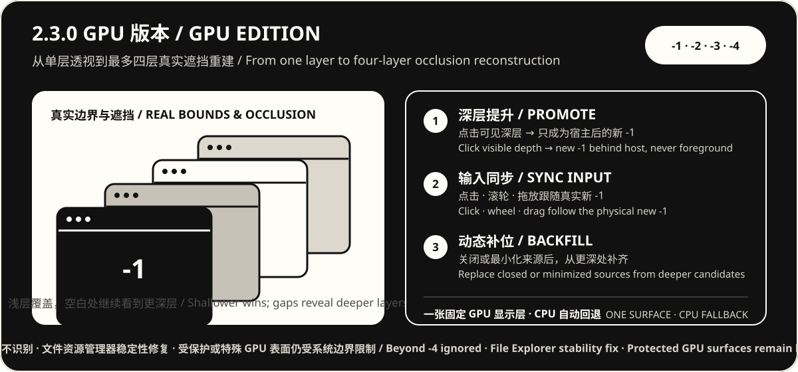

# 寸镜 / PierceView

<p align="center">
  
</p>


寸镜（PierceView）是一款轻量的 Windows 系统托盘效率工具。按住 `F8`，鼠标附近会出现圆角羽化矩形透视区域：它按真实位置同时重建宿主后方最多四层窗口，让你不离开当前工作就能查看、滚动、点击或拖放可见的后台内容；松开按键，当前窗口立即恢复。

PierceView is a lightweight Windows tray utility. Hold `F8` to open a rounded feathered rectangular portal around the pointer. It reconstructs up to four windows behind the host at their real positions, letting you view, scroll, click, or drag visible background content without leaving your current work. Release the key to restore the foreground immediately.

**当前公开版本 / Current public release:** `2.3.0 GPU Edition / GPU 版本`　|　**稳定回退版 / Stable fallback:** `2.1.0 CPU Edition / CPU 版本`

> **无需安装 / No installer** · **本地运行 / Local only** · **GPU 优先、CPU 自动回退 / GPU-first with automatic CPU fallback**

## 为什么是寸镜 / Why PierceView

很多次 `Alt+Tab` 并不是为了真正切换工作，只是想看一眼后台页面上的数字、进度或几行文字。寸镜把这次来回切换缩短成一次按住：思路留在当前窗口，关键信息从后面直接出现。

Many `Alt+Tab` trips are not real context switches—you only need a number, a status, or a few lines from another app. PierceView turns that round trip into one hold, keeping your attention in the foreground while the useful detail appears through it.

- **少切换 / Fewer context switches** — 查看参考资料、AI 进度、聊天消息或网页状态时，不必离开当前应用。Peek at references, AI progress, messages, or page status without leaving your current app.
- **不只看，还能操作 / More than a preview** — 透视区域内可以直接滚动和点击后台应用，同时尽量维持原有窗口层级。Scroll and click through the portal while PierceView preserves the foreground order where Windows allows it.
- **灵活拖放 / Flexible drag-and-drop** — 当两端都支持 Windows 原生拖放时，可以在后台抓住文字、图片或文件，松开 `F8` 后把内容带回当前应用。When both apps support native Windows drag-and-drop, start the drag behind the portal, release `F8`, and drop the content into your current app.
- **等待时也轻松一点 / A lighter wait** — 等待 AI 处理或回复时，你可以留在工作页面，顺手看一眼后台内容——偶尔摸个鱼也很自然。While AI is thinking, stay in context and casually peek at something else.

## 如何工作 / How it works


1. 把鼠标移到想查看的位置。Move the pointer to the information you want.
2. 按住 `F8` 打开并移动透视区域。Hold `F8` to open and move the portal.
3. 查看最多四层后台窗口；点击透视框内可见的深层窗口，可把它换到当前应用正后方。View up to four background layers; click a visible deeper window to move it directly behind the current app.
4. 松开 `F8`，关闭透视并恢复当前窗口。Release `F8` to close the portal and restore the foreground.

### 从 2.2 到 2.3 / From 2.2 to 2.3

| 2.2.0 GPU Edition | 2.3.0 GPU Edition |
|---|---|
| 单层 GPU 透视 / One GPU source | 最多四层真实遮挡重建 / Up to four-layer occlusion reconstruction |
| F8 会话固定一个来源 / One fixed source per F8 hold | 点击可见深层窗口，成为宿主后方新 `-1` / Click visible depth to make it the new `-1` behind the host |
| 仅操作原 `-1` / Interact with the original `-1` | 点击、滚轮、拖放与新真实 `-1` 同步 / Click, wheel, and drag follow the new physical `-1` |
| 来源关闭后会话结束或回退 / Source loss ends or falls back | 关闭/最小化后自动从更深候选补位 / Closed or minimized sources backfill automatically |

2.3 GPU 版本沿用 `Windows.Graphics.Capture → D3D11 常驻纹理 → HLSL 遮挡/羽化 → DirectComposition` 稳定管线，并把来源扩展为宿主后方最多 `-1` 至 `-4`。各窗口分别捕获，GPU 按真实窗口边界与 Z-order 重建遮挡，最后仍只通过一张固定显示层提交；不是把四张截图半透明叠加。

The 2.3 GPU Edition extends the stable `Windows.Graphics.Capture → persistent D3D11 texture → HLSL occlusion/feathering → DirectComposition` pipeline to at most layers `-1` through `-4`. Each window is captured independently, then the GPU reconstructs real bounds and Z-order before one fixed display surface is presented. It does not alpha-stack four screenshots.



点击透视框内真正可见的深层窗口时，寸镜只把它提升为宿主正后方的新 `-1`，不会把它顶到桌面最前面；后续点击、滚轮和拖放会跟随新的真实输入层级。会话中关闭或最小化来源后，寸镜会从更深处自动补位，但始终不识别超过 `-4` 的窗口。GPU 不可用或会话失败时自动回退到 2.1.0 单层 CPU 稳定管线。

Clicking a genuinely visible deeper window moves it only to the new `-1` slot behind the host—never above the current app. Subsequent click, wheel, and drag input follows that physical order. Closing or minimizing a source during the hold automatically backfills from deeper candidates, while anything beyond `-4` remains intentionally unsupported. If the GPU session is unavailable or fails, PierceView falls back to the stable single-layer 2.1.0 CPU pipeline.

## 下载 / Download

**系统要求 / Requirements:** Windows 10/11 x64。无需安装；推荐 GPU 版本，若 GPU 路径不可用会自动回退 CPU。另保留体积更小、无需独立显卡的 2.1.0 CPU 版本。Windows 10/11 x64; no installer is required. The GPU Edition is recommended and automatically falls back to CPU when needed. The smaller 2.1.0 CPU Edition remains available and requires no discrete GPU.

| 文件 / File | 用途 / Purpose | SHA256 |
|---|---|---|
| [PierceView-v2.3.0-gpu-win-x64.exe](../../releases/download/v2.3.0/PierceView-v2.3.0-gpu-win-x64.exe) | **推荐：最多四层 GPU 透视 + CPU 自动回退 / Recommended: up to four GPU layers + automatic CPU fallback** | `7E0CA2CEC38FA5F0AC36D6E2B5AE8FC1F29679002EBF2D6720573682BEEECBF1` |
| [PierceView-v2.1.0-cpu-win-x64.zip](../../releases/download/v2.1.0/PierceView-v2.1.0-cpu-win-x64.zip) | 推荐 CPU 下载包 / Recommended CPU package | `CCD0E3124950C5F13F6A7167662D923F6A34549CE963A37AD6A69F3B0209A0CB` |
| [PierceView-v2.1.0-cpu-win-x64.exe](../../releases/download/v2.1.0/PierceView-v2.1.0-cpu-win-x64.exe) | CPU 单文件程序 / CPU single-file app | `122FDD80EB3888E5FB703D8D309574E6A7908EF180E5A89C862F4DB79D84D7BC` |

当前发布包尚未做 Windows 代码签名（Authenticode），系统可能提示“未知发布者”。这表示 Windows 无法通过证书确认发布者身份，**不是**程序缺少产品名或图标。请只从本仓库 [Releases](../../releases) 下载，并用上表 SHA256 校验；来源不确定时不要运行。

The current build is not Authenticode-signed, so Windows may show “Unknown publisher.” That means Windows cannot verify the publisher via a certificate—it does **not** mean the app lacks a product name or icon. Download only from this repository’s [Releases](../../releases) and verify the SHA256 above; do not run a copy whose origin is uncertain.

产品介绍页 / Product site：<https://nixz0824.github.io/PierceView/>（源码在 `landing/`）。

## 快速开始 / Quick start

1. 下载 GPU 单文件 EXE 并直接运行；如选择 CPU ZIP，请解压后运行其中的 `PierceView.exe`。Download and run the GPU single-file EXE directly; if you choose the CPU ZIP, extract it and run `PierceView.exe`.
2. 应用不会打开主窗口；请在 Windows 通知区域寻找寸镜图标。No main window opens; find the PierceView icon in the Windows notification area.
3. 按住 `F8` 开启透视，松开恢复。Hold `F8` to open the portal; release it to restore.
4. 双击托盘图标打开设置；右键可启动/暂停、查看帮助或退出。Double-click the tray icon for settings; right-click to start/pause, open Help, or exit.

设置包含透视尺寸、边缘羽化与界面语言；2.3 运行路径固定使用圆角羽化矩形，历史形状设置仍会保存在 `%LOCALAPPDATA%\PierceView\settings.json`，供旧版本继续读取。Settings include portal size, edge feathering, and UI language. The 2.3 runtime uses a rounded feathered rectangle; historical shape settings remain in the local settings file for older releases.

## 能做什么 / Features

| 能力 / Capability | 2.3 GPU 版本行为 / Version 2.3 GPU Edition behavior |
|---|---|
| 系统托盘 / System tray | 普通启动无主窗口；提供启动/暂停、设置、帮助与退出。No persistent main window; Start/Pause, Settings, Help, and Exit live in the tray. |
| 四层遮挡重建 / Four-layer reconstruction | 圆角羽化矩形按真实边界同时显示宿主后方最多 `-1` 至 `-4`；超过 `-4` 不识别。The rounded feathered rectangle reconstructs at most layers `-1` through `-4` at their real bounds; deeper layers are ignored. |
| 深层窗口提升 / Deep-window promotion | 点击可见深层窗口，只把它变为宿主后方的新 `-1`，宿主保持前台。Click a visible deeper window to make it the new `-1` behind the host while the host remains foreground. |
| 输入同步 / Input synchronization | 点击、滚轮和拖放跟随新的真实 `-1`，不只改变视觉顺序。Click, wheel, and drag follow the new physical `-1`, not merely the visual order. |
| 动态补位 / Dynamic backfill | 会话中来源关闭或最小化后自动从更深窗口补齐，仍严格限制四层。Closed or minimized sources are replaced from deeper candidates while the four-layer limit remains strict. |
| 跨应用拖放 / Cross-app drag-and-drop | 两端应用与权限都兼容时可用；并非所有文字、图片、文件或网页都支持。Works when both apps and privilege levels support the same native drag format. |
| 双语界面 / Bilingual UI | 托盘、设置、首次提示与帮助支持简体中文和 English。Tray, Settings, first-run hint, and Help support Simplified Chinese and English. |
| GPU 加速与回退 / GPU acceleration & fallback | 优先使用 WGC/D3D11/DirectComposition；不可用或失败时自动切换到 2.1.0 CPU 稳定管线。Prefers WGC/D3D11/DirectComposition and automatically switches to the stable 2.1.0 CPU pipeline if unavailable or unsuccessful. |

## 兼容性与安全 / Compatibility & safety

普通 Win32、WinForms、WPF、浏览器和常规 Electron 窗口通常兼容较好。以下类型可能只有点击、没有画面，或完全不可用：

Standard Win32, WinForms, WPF, browser, and ordinary Electron windows usually work best. The following may accept clicks without a visual, or may not work at all:

- 无重定向窗口与部分 DirectComposition 自绘界面。No-redirection windows and some custom DirectComposition surfaces.
- DRM/HDCP 受保护视频、硬件 overlay、DirectX/Vulkan 独立表面与独占全屏。Protected video, hardware overlays, independent GPU surfaces, and exclusive fullscreen.
- UAC 安全桌面、锁屏、其他虚拟桌面的隐藏窗口和权限更高的窗口。Secure system desktops, cloaked windows on other virtual desktops, and higher-privilege windows.
- 游戏、游戏启动器及 EAC、BattlEye、Vanguard、FACEIT 等反作弊环境。Games, launchers, and anti-cheat environments such as EAC, BattlEye, Vanguard, and FACEIT.

**启动任何游戏、游戏启动器或反作弊服务前，请从托盘完全退出寸镜；该规则不限于网游。**

**Fully exit PierceView from the tray before starting any game, launcher, or anti-cheat service. This is not limited to online games.**

寸镜以普通用户权限运行，不注入进程、不读取或写入其他进程内存、不模拟输入、不联网、不上传遥测、不安装驱动或全局低级键鼠钩子，也不设置 Windows 自启动。它会临时使用窗口 region、扩展样式、Z-order 和 DWM thumbnail，因此不能承诺与所有安全软件或保护机制零冲突。

PierceView runs at standard-user privilege. It does not inject into processes, read or write other-process memory, synthesize input, connect to the network, upload telemetry, install drivers or global low-level mouse/keyboard hooks, or configure Windows startup. It temporarily uses window regions, extended styles, Z-order, and DWM thumbnails, so zero conflict with every security product cannot be guaranteed.

详细边界见[兼容性说明](docs/COMPATIBILITY.md)与[安全模型](docs/SECURITY.md)。See [Compatibility](docs/COMPATIBILITY.md) and [Security model](docs/SECURITY.md) for the full boundaries.

## 已知限制 / Known limitations

- 2.3 多层 GPU 路径固定使用圆角羽化矩形；圆形仍属于 2.1/2.2 单层路线。The 2.3 multi-layer GPU path uses a rounded feathered rectangle; circles remain part of the 2.1/2.2 single-layer line.
- 只识别宿主后方最多四层；完全被浅层遮住、在透视框中不可见的深层窗口不能直接点击提升。Only four layers behind the host are resolved; a deeper window that is completely occluded and invisible inside the portal cannot be promoted directly.
- 部分无重定向、受保护或特殊 GPU 表面可能只有点击、没有画面。Some no-redirection, protected, or special GPU surfaces may accept clicks without a visual.
- 跨应用拖放依赖两端应用的原生格式与权限，并非所有场景可用。Cross-app drag-and-drop depends on native formats and privilege levels; not every app pair supports it.
- 发布包尚未代码签名，首次运行可能被 SmartScreen 提示。The release is not code-signed; SmartScreen may prompt on first run.

## 构建 / Build

需要 Windows 10/11 与 .NET 8 SDK。Requires Windows 10/11 and the .NET 8 SDK.

```powershell
dotnet build .\src\WindowPortal\WindowPortal.csproj -c Release
pwsh -File .\tests\run-non-gui-tests.ps1
pwsh -File .\tests\tray-smoke-test.ps1
```

GUI 子系统构建建议通过 DLL 运行诊断命令，以获得稳定的控制台输出。For GUI-subsystem builds, run diagnostics through the DLL for reliable console output.

```powershell
dotnet .\src\WindowPortal\bin\Release\net8.0-windows10.0.19041.0\PierceView.dll --self-test
dotnet .\src\WindowPortal\bin\Release\net8.0-windows10.0.19041.0\PierceView.dll --version
dotnet .\src\WindowPortal\bin\Release\net8.0-windows10.0.19041.0\PierceView.dll --list-windows
```

## 文档 / Documentation

公开文档只保留用户与开发者日常需要的内容：

Public docs keep only what users and everyday contributors need:

- [架构 / Architecture](docs/ARCHITECTURE.md) — 2.3 四层 GPU 遮挡重建、输入同步与 CPU 回退 / 2.3 four-layer GPU reconstruction, input synchronization, and CPU fallback
- [兼容性 / Compatibility](docs/COMPATIBILITY.md) — 适用窗口与已知边界 / supported windows and known boundaries
- [安全模型 / Security model](docs/SECURITY.md) — 权限、能力边界与安全报告方式 / privileges, capability boundaries, and how to report issues
- [变更记录 / Changelog](CHANGELOG.md)
- [贡献指南 / Contributing](CONTRIBUTING.md)
- [许可 / License](LICENSE) — **非商业许可 / Noncommercial**（PolyForm Noncommercial 1.0.0）

内部规划、路线细节、市场调研与发布验收清单不在公开仓库中。Internal roadmaps, research notes, and release checklists are not published in this repository.

## 参与与许可 / Contributing & license

提交问题前请阅读[贡献指南 / Contributing guide](CONTRIBUTING.md)，并附上版本、Windows 版本、窗口组合与可复现步骤；不要上传包含私人桌面内容的截图或日志。Before opening an issue, read the [contributing guide](CONTRIBUTING.md) and include the app version, Windows version, window combination, and reproduction steps. Do not upload screenshots or logs containing private desktop content.

本项目采用 [PolyForm Noncommercial License 1.0.0](LICENSE)：**允许个人与非商业使用；禁止商业用途**（含出售、依赖本软件功能的商业产品/服务、商业支持与面向销售的研发等）。商业使用须事先取得版权方书面许可。

This project is licensed under the [PolyForm Noncommercial License 1.0.0](LICENSE): **personal and noncommercial use is allowed; commercial use is not** (including selling the software, products/services whose value substantially depends on it, commercial support, and development intended for sale). Commercial use requires prior written permission from the copyright holder.
